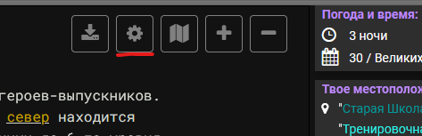
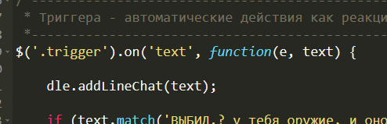

- [Установка](#Установка)
- [Настройки](#Настройки)
    - [Общие](#Общие)
    - [Чат](#Чат)

# Установка
1. В игре нажмите на кнопку параметров

2. Вставте нижепредставленный скрипт в появившееся окно в самом вверху
```js
function dreamLandWebExtand(){
    /*НАСТРОЙКИ*/
    let settings = {
        'chatView':     true,
        'chatWithNpc':  false,
        'chatParam': {
            'width':    '20%',
            'height':   '150px'
            },
        'phrases': [
            ["^(.*) произносит '(.*)'", 'fgdg'],
            ["^\[внероли\] (.*): '(.*)'", 'fgdr'],
            ["^(.*) говорит тебе '(.*)'", 'fgbc']
        ]
    }

    function start(){
        if (settings.chatView) {
            $('body').prepend('<div id="dle-modal-chat" style="position: absolute;top: 1px;right: 1px;z-index: 999;width: ' + settings.chatParam.width + ';"> <button data-state="1" aria-hidden="true" class="btn btn-sm btn-outline-primary" style="position: absolute; top: 0px; right: 0px;" id="dle-btn-chat">  <i class="fa fa-minus" id="dle_btn_style"></i>  </button> <div id="dle-chat" style="background-color: #353535; border-radius: 0px 0px 0px 15px; height: ' + settings.chatParam.height + '; overflow-y: scroll;"> <ul style="list-style-type:  none; margin-left: -25px" id="dle_ul"></ul> </div></div>')

            $(document).on('click', '#dle-btn-chat', function(e, text) {
                if ($(this).data('state') === 0) {
                    $('#dle-chat').fadeIn(400);         
                    $(this).data('state', 1);
                    $('#dle_btn_style').removeClass("fa-plus").addClass('fa-minus');
                } else {
                    $('#dle-chat').fadeOut(400);
                    $(this).data('state', 0);
                    $('#dle_btn_style').removeClass("fa-minus").addClass('fa-plus');
                }
                return false
            });

            $(document).on('click', '.dle-Answer', function(e, text) {
                let p1 = $(this).data('type');
                let p2 = $(this).data('speaker');
                $('#inputBox').val(`${p1} ${p2}`);
            })
        }
    }

    function addLineChat(msg) {
        let result = '';
        
        settings.phrases.forEach((item) => {
            let result = msg.match(item);
            if (result) {
                $('#dle_ul').append(`<li><span class="${item[1]}">${result[1]}</span>&gt; ${result[2]}</li>`)
                document.getElementById('dle-chat').scrollTop = scrollTop = document.getElementById('dle-chat').scrollHeight;
                return
            }
        })
    }

    return {
        'addLineChat': addLineChat,
        'start': start,
    }
}

const dle = dreamLandWebExtand();
dle.start();
```
3. В /\*НАСТРОЙКИ\*/ можно указать настройки для расширения (описание ниже)
4. В блоке "Триггер" укажите **dle.addLineChat(text);**


# Настройки
## Общие
- **phrases** (array) - массив шаблонов поиска

## Чат
- **chatView** (bool) - Включение/Отключение чата. Значаение по умолчанию true
- **chatWithNpc** (bool) - Включение/Отключение показа сообщений NPC. Значаение по умолчанию false
- **chatParam** (object) - параметры отображения чата
    - **width** (css) - Значенеи по умолчанию 20%
    - **height** (css) - Значенеи по умолчанию 150px